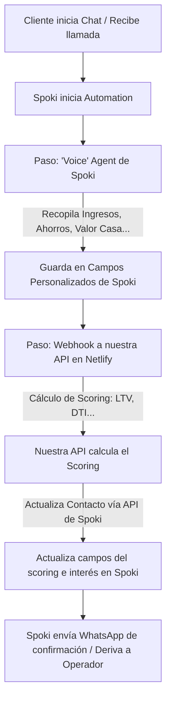

# Arquitectura de Scoring Hipotecario con Spoki (WhatsApp)

Este documento detalla la viabilidad, el diseño y la arquitectura técnica para integrar un sistema de **Scoring Hipotecario** en tiempo real mediante un **Agente de Voz y Conversación de WhatsApp** utilizando la plataforma de **Spoki**.

---

## 🚀 1. Viabilidad y Modalidades de Scoring

Tras analizar en detalle la API de Spoki, se confirma la viabilidad del proyecto en **tres modalidades** diferenciadas de interacción en WhatsApp, que se adaptan a las preferencias de cualquier cliente.

### A. 💬 Por Texto (Chat Guiado interactivo)
El canal con mayor fiabilidad y precisión en la captura de números y valores.
* **Flujo:** La automatización de Spoki envía preguntas estructuradas en orden secuencial usando mensajes interactivos (`InteractiveMessage` o `ListMessage`).
* **Captura:** El cliente responde seleccionando opciones con botones predefinidos o escribiendo valores numéricos.
* **Ventaja:** Cero errores de transcripción, lo cual garantiza que los datos financieros críticos (ingresos, valor de la propiedad, etc.) entren limpios a nuestra API de scoring.

### B. 🎙️ Por Audio (Notas de voz de WhatsApp)
El canal más natural para los usuarios que prefieren "hablar y explicar su caso".
* **Flujo:** El cliente envía un mensaje de voz estándar por WhatsApp explicando su situación financiera.
* **Captura:** La IA interna de Spoki (`AIOperator` y motores de Speech-to-Text integrados) transcribe la nota de voz a texto plano, extrae las variables mediante procesamiento de lenguaje natural (NLP) y rellena los campos personalizados del contacto.
* **Ventaja:** Máxima conveniencia para el cliente sin necesidad de desarrollar un motor propio de transcripción ni de gestionar archivos de audio manuales.

### C. 📞 Por Llamada (Agente de Voz Virtual con IA)
La experiencia más humanizada y premium del sistema.
* **Flujo:** Mediante el paso `"Voice"` nativo de la automatización de Spoki, el sistema inicia una llamada telefónica convencional saliente a través de la IA de voz.
  ```json
  {
    "step_type": "Voice",
    "agent_id": "agent_abc123"
  }
  ```
* **Captura:** El agente de voz de Spoki charla con el cliente, realiza las preguntas necesarias en tiempo real y, al colgar, vuelca automáticamente todos los datos recogidos en la ficha del contacto de Spoki.
* **Ventaja:** El usuario tiene una conversación fluida en tiempo real y, a los pocos segundos de colgar, recibe los resultados directamente en su chat de WhatsApp.

---

## 📐 2. Flujo de Datos y Arquitectura de la Integración

La integración entre **Spoki** y nuestra aplicación **Hipoteca Aquí** (Netlify Functions / Backend) es bidireccional y se ejecuta en tiempo real mediante webhooks.



### Paso 1: Configuración de Campos Personalizados (`custom_fields`) en Spoki
En la plataforma de Spoki crearemos campos específicos para guardar las respuestas del cliente:
* `%%INGRESOS_MENSUALES%%` (Numérico)
* `%%VALOR_VIVIENDA%%` (Numérico)
* `%%AHORROS_APORTADOS%%` (Numérico)
* `%%TIPO_CONTRATO%%` (Texto/Lista)
* `%%EDAD%%` (Numérico)
* `%%RESULTADO_SCORING%%` (Texto - Pre-aprobado / Rechazado / Estudio Manual)
* `%%CUOTA_MAXIMA%%` (Numérico)

### Paso 2: Disparo del Webhook desde Spoki hacia nuestra API
Una vez que el flujo (sea texto, nota de voz o llamada telefónica) ha recogido todos los datos y los ha asignado a los campos del contacto, Spoki realiza una petición HTTP POST a nuestro endpoint de Netlify:

* **Endpoint de nuestra API:** `https://hipotecaaqui.com/.netlify/functions/calcular-scoring`
* **Carga de datos (Payload de Spoki):**
  ```json
  {
    "contact": {
      "phone": "+34600112233",
      "first_name": "Javier",
      "last_name": "García"
    },
    "custom_fields": {
      "INGRESOS_MENSUALES": 2500,
      "VALOR_VIVIENDA": 200000,
      "AHORROS_APORTADOS": 40000,
      "TIPO_CONTRATO": "Indefinido",
      "EDAD": 35
    }
  }
  ```

### Paso 3: Lógica del Scoring en nuestra Netlify Function
Nuestra función procesa los datos y evalúa la viabilidad del préstamo:
1. **LTV (Loan-to-Value):** `(Valor Vivienda - Ahorros) / Valor Vivienda`. Por ejemplo: `(200,000 - 40,000) / 200,000 = 80%`.
2. **DTI (Debt-to-Income / Endeudamiento):** Estimación de la cuota mensual hipotética frente a los ingresos mensuales.
3. **Resultado:**
   * Si **LTV <= 80%** y **Endeudamiento <= 35%**: **Pre-aprobado**.
   * Si no cumple: **Estudio Manual** o **Rechazado**.

### Paso 4: Actualización del Scoring en Spoki a través de la API
Nuestra función de Netlify responde actualizando el contacto en Spoki para escribir los resultados y poder continuar el flujo automatizado:

* **Base URL de Spoki API:** `https://api.spoki.com/api/1/`
* **Método:** `POST`
* **Cabecera de Autenticación:** `X-Spoki-Api-Key: TU_API_KEY`
* **Petición para arrancar/actualizar flujo de scoring:**
  ```bash
  curl --location 'https://api.spoki.com/api/1/automations/' \
  --header 'X-Spoki-Api-Key: {{Api-Key}}' \
  --header 'Content-Type: application/json' \
  --data '{
    "name": "Resultado Scoring Hipotecario",
    "steps": [
      {
        "step_type": "TemplateMessage",
        "template": 456 // Plantilla con el resultado personalizado
      }
    ]
  }'
  ```

---

## 💎 3. Propuesta de Experiencia Híbrida (UX Recomendada)

Para maximizar la conversión y la satisfacción del cliente, se sugiere diseñar una experiencia combinada:

1. **Entrada:** El cliente entra desde un anuncio o web a WhatsApp y recibe un mensaje de bienvenida por **Texto**.
2. **Opción de Voz:** El sistema le pregunta:
   > *"Hola {{nombre}}, ¿prefieres que te llame ahora mismo nuestro asistente virtual para hacer tu simulación por voz en 2 minutos, o prefieres continuar respondiendo por chat?"*
   * [Boton 📞 Llamadme ahora]
   * [Boton 💬 Seguir por chat]
3. **Bifurcación:**
   * Si pulsa **Llamadme ahora**: Spoki inicia el paso `"Voice"` y le hace la llamada.
   * Si pulsa **Seguir por chat**: La automatización le pide los datos directamente por texto/audio en WhatsApp de forma asíncrona.
4. **Entrega de resultados:** Ambos caminos confluyen en el cálculo de nuestra API y devuelven el resultado y un PDF explicativo directo a su WhatsApp.
